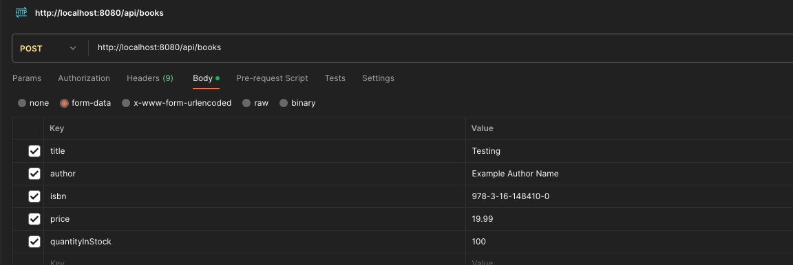

# Table of contents
1. Assignment Prompt
2. High Level Approach
3. How to use

# TODO: 
Search And Filter
Auth and Auth 
Error Handling (Actl this alr done just gotta add more error handlers)
Testing 
Performance Optimization (Low prio maybe use cache)

# Assignment
You are tasked with implementing a simple online bookstore inventory system. The inventory consists of books, and you need to design data structures and implement algorithms to manage the inventory. Additionally, you need to interact with a SQL database to store and retrieve data.

Requirement:

Implement a microservice Bookstore that contains the following functionality:
Add a book to the inventory.
Remove a book from the inventory.
Update the quantity in stock for a given book.
Retrieve the quantity in stock for a given book.
List all books in the inventory.
Implement at least one popular design pattern in your solution. You can choose from patterns like Singleton, Factory, Observer, Strategy, or any other appropriate pattern that fits the context of the problem.
Additional Requirements (Bonus Points):

Search and Filter Functionality: Implement a search functionality that allows users to search for books by their title, author, or ISBN. Additionally, add filtering options to search for books based on price range, availability, or any other relevant criteria.
Authentication and Authorization: Implement a simple authentication mechanism for users, including registration and login. Ensure that only authenticated users can perform certain actions, such as adding books to the inventory or making purchases.
Error Handling and Logging: Implement robust error handling and logging mechanisms to capture and log any exceptions or errors that occur during the execution of the system.
Performance Optimization: Optimize the database queries and operations for improved performance and efficiency, especially when dealing with large datasets.
Instructions:

Use Java to implement the classes and methods described above. You may use any popular java framework such as Spring Boot, Micronaut, hibernate etc...
Use any relational database of your choice (e.g., MySQL, PostgreSQL) for storing the book information. Include instructions on how to set up the database schema and connection details in your submission.
You can use any appropriate data structures and algorithms to implement the functionalities.
Make sure to handle any potential exceptions or errors that may occur during database interactions or book inventory management.

# Design Pattern used
Certainly. Let's address the structures in the context of the design patterns provided in the prompt.
In our solution, one could argue that the Singleton Pattern is implicitly employed through Spring's default behavior of beans. The components such as the BookService and BookController are treated as singletons by the Spring framework. This ensures that there's only one instance of these beans throughout the application, promoting efficient resource use.
The Factory Pattern can be seen in how Spring manages the instantiation of beans. While we haven't explicitly coded a factory, the Spring framework underneath leverages this pattern when creating instances of our services, repositories, and controllers. The @Autowired annotation and the Spring container handle the responsibility of creating the right object, abstracting away the instantiation details from the developer.
While we haven't directly used the Observer or Strategy patterns in the provided code, one could envision potential applications. For instance, an Observer pattern could be employed to notify other parts of the system when a new book is added, or the quantity changes, keeping various components in sync. The Strategy pattern could be introduced in the future if we decide to have multiple algorithms or strategies to calculate prices, promotions, or discounts for books.
Regarding the Behavior pattern, it's not a conventional design pattern like the others mentioned. However, in the broader sense, behavioral patterns like Command, Iterator, or Visitor could be integrated into our system. For instance, if we had a series of operations to perform on each book (like a set of validations or transformations), the Command pattern would be appropriate.
Finally, the Application, ErrorController, and Maven builds, while embodying best practices, are more about the architecture and tooling than specific design patterns mentioned in the prompt. They ensure modularity, maintainability, and a robust application lifecycle but don't directly map to the mentioned patterns.
TLDR;
In our solution, the Singleton Pattern is present via Spring's default bean behavior, ensuring single instances of BookService and BookController. The Factory Pattern is indirectly utilized by Spring when instantiating our services, repositories, and controllers, with the @Autowired annotation abstracting object creation.
Though we didn't directly implement the Observer or Strategy patterns, they have potential applications. An Observer pattern could notify system parts of book changes, and the Strategy pattern might offer varied book pricing algorithms in the future.
Lastly, while tools like the Application, ErrorController, and Maven builds represent architectural best practices, they aren't directly aligned with the specific design patterns listed, instead ensuring modularity and robust application management.

# Failed Requests (Errored Out, Caught and Handled Gracedully)
Failed Request #1. 
`curl -v -X POST http://localhost:8080/api/books \
-H 'Content-Type: application/json' \
-d '{
"title": "Example Book Title",
"author": "Example Author Name",
"isbn": "978-3-16-148410-0",
"price": 19.99,
"quantityInStock": 100
}'`
Custom Error Message: {"status":"BAD_REQUEST","message":"Database error. Possible constraint violation."}
Custom Error Logs:
section-2-java-assignment-onlinebookstore-1  | 2023-08-12T12:14:07.800Z ERROR 1 --- [nio-8080-exec-1] o.h.engine.jdbc.spi.SqlExceptionHelper   : ERROR: null value in column "title" of relation "books" violates not-null constraint
section-2-java-assignment-onlinebookstore-1  |   Detail: Failing row contains (4, null, null, null, null, null).
section-2-java-assignment-onlinebookstore-1  | 2023-08-12T12:14:07.807Z ERROR 1 --- [nio-8080-exec-1] c.o.controller.CustomErrorController     : Database constraint violation: could not execute statement [ERROR: null value in column "title" of relation "books" violates not-null constraint
section-2-java-assignment-onlinebookstore-1  |   Detail: Failing row contains (4, null, null, null, null, null).] [insert into books (author,isbn,price,quantity,title) values (?,?,?,?,?)]; SQL [insert into books (author,isbn,price,quantity,title) values (?,?,?,?,?)]; constraint [title" of relation "books]

Failed Request #2. 

Custom Error Message: {
"status": "UNSUPPORTED_MEDIA_TYPE",
"message": "Unsupported media type."
}
Custom Error Logs:
section-2-java-assignment-onlinebookstore-1  | 2023-08-12T12:20:44.035Z ERROR 1 --- [io-8080-exec-10] c.o.controller.CustomErrorController     : Unsupported media type error: Content-Type 'multipart/form-data;boundary=--------------------------134852517067505583880478;charset=UTF-8' is not supported

# High Level Approach
- Functional Requirements:
  - Microservice that does simple HTTP actions, GET, PUT, UPDATE, DELETE
  - Need to decide on ORM: How Java Classes map to the DB Schema
  - Need to decide on the DB Schema 
  - Need to standup a mock DB for app to talk to
  - Need to decide on Java framework to use here
  - Design Pattern to use here. (Singleton, Factory, Observer, Strategy etc) and pros and cons
  - Decide if need a simple webserver to talk to backend

- Additional Requirements:
  - Search and Filter: Search by title, author, ISBN? AND filter by price, avail etc. 
    - If search and filter, prolly need a webserver with a search bar and filter with checkboxes and scrollers
    - Typical search API with a /search?queryString=author pattern will be needed
  - Authenticate and Authorize: Registration and login. Only authenticated users can UPDATE inventory and make purchases?
    - Few ways can tackle this: 
    - Most man mode way: create a table for users, on user registration, take in user login and pw as text,
    - On calling the Registration API, a random seed is generated based on timestamp, concat the user pw with the seed (salt) and SHA256 it
    - Write the hashed pw and random seed and user login to DB (Plaintext pw is never stored in DB.)
    - On calling the Login API, retrieve the random seed, and hashed pw based on user login, take the user provided pw, concat with random seed, sha256 it
    - Compare this SHA256 string with the correct one stored in DB. If the two strings are equal, user is authenticated, return a user token. 
    - Once user token is generated, the user token needs to be supplied to the UPDATE books API in the header of the HTTP request. 
    - Other ways can be considered using AWS Cognito or using IDP (Identity provider), Approach uses SAML and Auth0. 
  - Error handling and logging: 
    - Rely on springboot exception handlers like @ControllerAdvice
    - Use logging library like Log4j to log exceptions and events
  - Improve Performance of DB:
    - Index important fields in postgres where queries hit the most
    - Consider using cache like redis or memcached 

- Deployment Considerations:
  - Docker Approach:
    - Docker Image that contains the Java codebase in a standalone monolithic Service
    - Docker Image that contains the Postgres container that will serve as the database
    - Possibly also need another Docker image if need a simple frontend
    - docker-compose for the networking needed between two docker containers on localhost
  - AWS Approach (To be attempted if there is enough time?) :
    - Each functionality is its own Serverless lambda, Add book, remove book, Update qty, Retrieve qty, List all books
    - Each lambda is its own endpoint on API gateway with the respective HTTP action, GET, PUT, UPDATE, DELETE
    - Postgres DB to be stood up on RDS